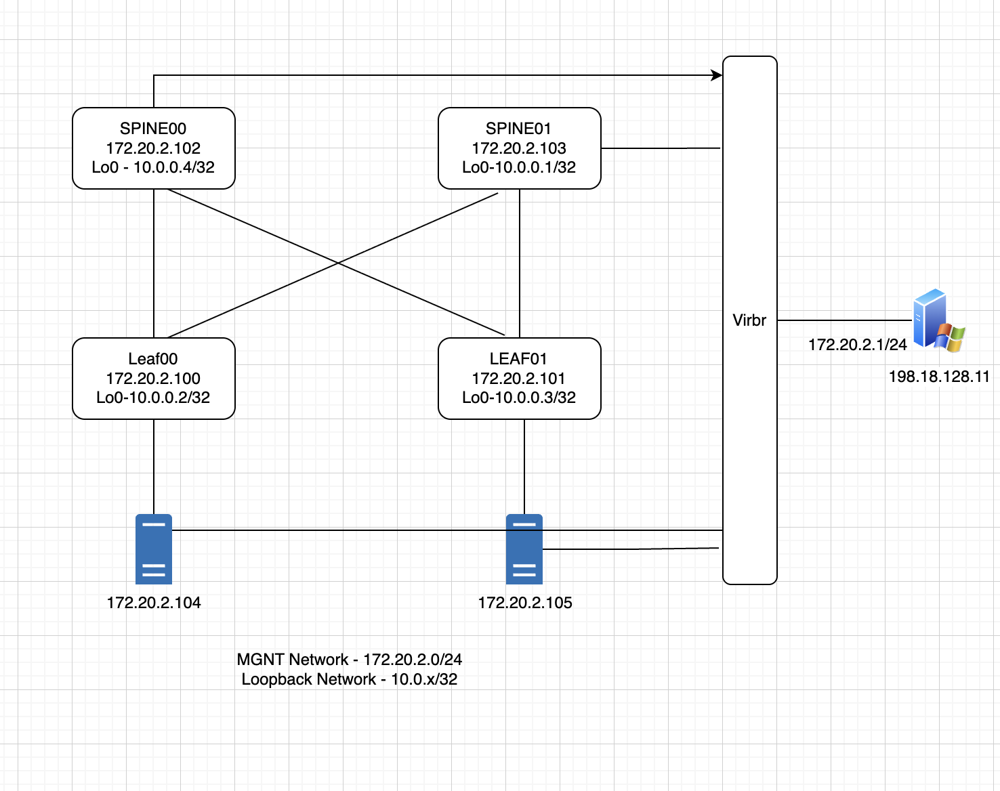

# LABMSI-2005 - Try SONiC { Intermediate } - Open Network Operating System powering the Next-gen AI-Data Center

**Objective:** Go beyond the basics of SONiC — trace a BGP prefix end-to-end through every SONiC layer (FRR → RIB → kernel FIB → Redis → ASIC), configure and validate control-plane and data-plane ACLs, stream telemetry via gNMI, and learn the right way to gather logs and artifacts for TAC engagements.

**Duration:** 60–90 minutes

**Prerequisites:**
- Completion of **LABMSI-1011** (Introductory SONiC) or equivalent SONiC familiarity
- A running SONiC device (lab leaf, e.g. `leaf00`) reachable over SSH
- Admin credentials (`admin` user)
- Basic familiarity with `vtysh`, `redis-cli`, and Linux CLI

---

## Table of Contents

- [Lab Overview](#lab-overview)
- [Lab Topology](#lab-topology)
- [Lab Setup Verification](#lab-setup-verification)
  - [Step 1: SSH to the Virtual Host](#step-1-ssh-to-the-virtual-host)
  - [Step 2: Confirm Reachability](#step-2-confirm-reachability)
  - [Step 3: SSH Access](#step-3-ssh-access-to-the-node-that-is-successful)
- [Exercise 1: Tracing a BGP Route End-to-End Through the SONiC Layers (20 minutes)](#exercise-1-tracing-a-bgp-route-end-to-end-through-the-sonic-layers-20-minutes)
  - [Task 1.1: Pick a Prefix and Confirm It in BGP](#task-11-pick-a-prefix-and-confirm-it-in-bgp)
  - [Task 1.2: Confirm the Route in the FRR RIB (zebra)](#task-12-confirm-the-route-in-the-frr-rib-zebra)
  - [Task 1.3: Confirm the Route in the Linux Kernel FIB](#task-13-confirm-the-route-in-the-linux-kernel-fib)
  - [Task 1.4: Trace into APPL_DB (Redis DB 0)](#task-14-trace-into-appl_db-redis-db-0)
  - [Task 1.5: Trace into ASIC_DB (Redis DB 1)](#task-15-trace-into-asic_db-redis-db-1)
  - [Task 1.6: Confirm Hardware Programming in the NPU](#task-16-confirm-hardware-programming-in-the-npu)
  - [Validation Checklist](#validation-checklist)
- [Exercise 2: iptables, Control-Plane ACL, and Data-Plane ACL in SONiC (25 minutes)](#exercise-2-iptables-control-plane-acl-and-data-plane-acl-in-sonic-25-minutes)
  - [Task 2.1: Concept — Two Enforcement Paths, One Model](#task-21-concept--two-enforcement-paths-one-model)
  - [Task 2.2: Inspect Default iptables on a SONiC Device](#task-22-inspect-default-iptables-on-a-sonic-device)
  - [Task 2.3: Control-Plane ACL — Restrict SSH via JSON](#task-23-control-plane-acl--restrict-ssh-via-json)
  - [Task 2.4: Data-Plane ACL (Optional)](#task-24-data-plane-acl-optional)
  - [Task 2.5: Cleanup — Use the Config Checkpoint (Optional)](#task-25-cleanup--use-the-config-checkpoint-optional)
- [Exercise 3: Stream Telemetry with gNMI (15 minutes)](#exercise-3-stream-telemetry-with-gnmi-15-minutes)
  - [Task 3.1: Validate gnmic Collector on the Host](#task-31-validate-gnmic-collector-on-the-host)
  - [Task 3.2: Validate gNMI is Enabled on the SONiC Device](#task-32-validate-gnmi-is-enabled-on-the-sonic-device)
  - [Task 3.3: Get gNMI Supported Capabilities](#task-33-get-gnmi-supported-capabilities)
  - [Task 3.4: Get show version via gNMI](#task-34-get-show-version-via-gnmi)
  - [Task 3.5: Gather Interface Telemetry via OpenConfig](#task-35-gather-interface-telemetry-via-openconfig)
  - [Task 3.6: Query Redis Directly via gNMI](#task-36-query-redis-directly-via-gnmi)
- [Exercise 4: Troubleshoot Like a Pro (15 minutes)](#exercise-4-troubleshoot-like-a-pro-15-minutes)
  - [Task 4.1: journalctl — The Boot and Systemd View](#task-41-journalctl--the-boot-and-systemd-view)
  - [Task 4.2: /var/log/syslog — The Unified Application Log](#task-42-varlogsyslog--the-unified-application-log)
  - [Task 4.3: Per-Container Logs with docker logs](#task-43-per-container-logs-with-docker-logs)
  - [Task 4.4: show logging and Component Log Levels](#task-44-show-logging-and-component-log-levels)
  - [Task 4.5: show techsupport — The TAC Bundle](#task-45-show-techsupport--the-tac-bundle)
- [Lab Wrap-Up](#lab-wrap-up)
  - [Cheat Sheet](#cheat-sheet)

---

## Lab Overview

For participants who have completed the introductory SONiC lab (or have basic SONiC familiarity), this hands-on session takes you deeper into how SONiC works internally. You will:

- Trace a BGP Prefix end-to-end — follow its journey from FRR into the RIB → FIB → Redis DB → ASIC, and see how SONiC programs the dataplane.
- Configure & Validate ACLs — apply both control-plane and data-plane ACLs, then verify enforcement across the stack.
- Stream Telemetry with gNMI — tap into multiple data sources to collect real-time operational insights.
- Troubleshoot Like a Pro — navigate SONiC to gather the right logs and artifacts for effective TAC engagement.

> **Note:** The lab device is a **containerlab** node running real SONiC on a virtual **Cisco-8101-32FH-O** hardware. All CLI commands, Redis, and config files behave exactly as they do on physical hardware.

---

## Lab Topology



> **Note:** Some nodes may be unavailable due to virtual-host resource limits. You will need access to two of the four devices (leaf00/01 or spine00/01) to work through this intermediate SONiC lab.

---

## Lab Setup Verification

### Step 1: SSH to the Virtual Host
Use your putty sessions and land on the virtual host

```bash
ssh cisco@198.18.200.11
#password:cisco123
cd /home/cisco/cisco8000e/sonic-clab/c8101/ansible
```

**Expected Output:*

```
/home/cisco/cisco8000e/sonic-clab/c8101/ansible
```

### Step 2: Confirm Reachability

```bash
ansible all -i hosts -m ping
```

**Expected Output**

```
localhost | SUCCESS => {
    "ansible_facts": {
        "discovered_interpreter_python": "/usr/bin/python3"
    },
    "changed": false,
    "ping": "pong"
}
leaf00 | SUCCESS => {
    "changed": false,
    "ping": "pong"
}
spine00 | SUCCESS => {
    "changed": false,
    "ping": "pong"
}
leaf01 | SUCCESS => {
    "changed": false,
    "ping": "pong"
}
spine01 | SUCCESS => {
    "changed": false,
    "ping": "pong"
}
```

> **Note** - Insome scenarios, some of the nodes may not respond due to resource constrains. Lab has been structured with minimal nodes.


### Step 3: SSH Access to the Node That Is Successful
```bash
ssh admin@leaf00
# Default password: password (or as provided)
```
**Expected Output:**

```text
Linux leaf00 6.1.0-11-2-amd64 #1 SMP PREEMPT_DYNAMIC Debian 6.1.38-4 (2023-08-08) x86_64
You are on
  ____   ___  _   _ _  ____
 / ___| / _ \| \ | (_)/ ___|
 \___ \| | | |  \| | | |
  ___) | |_| | |\  | | |___
 |____/ \___/|_| \_|_|\____|

-- Software for Open Networking in the Cloud --

Unauthorized access and/or use are prohibited.
All access and/or use are subject to monitoring.

Help:    https://sonic-net.github.io/SONiC/

Last login: Mon May 25 18:16:52 2026 from 172.20.2.1
admin@leaf00:~$ 
```

Expected: a prompt like `admin@leaf00:~$`

---

## Exercise 1: Tracing a BGP Route End-to-End Through the SONiC Layers (20 minutes)

### Objective
Trace an IPv4 BGP-learned prefix end-to-end across every SONiC software layer — from FRR's BGP table, down through the kernel FIB, through the Redis state databases (APPL_DB → ASIC_DB), and finally into the NPU hardware forwarding table. By the end you'll understand exactly *how* a route propagates inside SONiC.

---

### Topology / Prerequisites

- A SONiC device with at least one active IPv4 eBGP neighbor (this lab uses `Spine0` peering in AS 65000).
- A prefix advertised by that neighbor. We'll use **`10.0.0.3`**.
- SSH access as `admin` with `sudo` privileges.
- Basic familiarity with `vtysh` and `redis-cli`.

### The SONiC Route Pipeline (Model)

```
   ┌──────────┐   ┌──────────┐   ┌──────────┐   ┌─────────┐   ┌──────────┐   ┌──────────┐
   │   BGP    │──▶│   RIB    │──▶│  Kernel  │──▶│ APPL_DB │──▶│ ASIC_DB  │──▶│   NPU    │
   │  (bgpd)  │   │ (zebra)  │   │   FIB    │   │ (db 0)  │   │  (db 1)  │   │ (SAI HW) │
   └──────────┘   └──────────┘   └──────────┘   └─────────┘   └──────────┘   └──────────┘
       FRR           FRR           Linux         fpmsyncd       orchagent      syncd/SDK
                                                 + bgpd-fpm
```

The Redis instance hosts multiple logical DBs:

| DB # | Name | Purpose |
|------|------|---------|
| 0 | `APPL_DB` | App-level intent (what apps *want* in the dataplane) |
| 1 | `ASIC_DB` | SAI objects programmed in the ASIC |
| 2 | `COUNTERS_DB` | Counters |
| 4 | `CONFIG_DB` | User configuration |
| 6 | `STATE_DB` | Runtime state |

---

### Task 1.1: Pick a Prefix and Confirm It in BGP

```bash
ssh admin@leaf00
show ip bgp net 10.0.0.3
```

**Expected output:**

```
BGP routing table entry for 10.0.0.3/32, version 12
Paths: (2 available, best #1, table default)
  Advertised to non peer-group peers:
  10.1.1.0 10.1.1.4
  65000 65002
    10.1.1.0 from 10.1.1.0 (10.0.0.0)
      Origin IGP, valid, external, multipath, best (Router ID)
      Last update: Tue May 19 18:15:14 2026
  65000 65002
    10.1.1.4 from 10.1.1.4 (10.0.0.1)
      Origin IGP, valid, external, multipath
      Last update: Tue May 19 18:15:14 2026
```
**Observation**

- This is an ECMP path, and we will focus on the best route.

---

### Task 1.2: Confirm the Route in the FRR RIB (zebra)

```bash
show ip route 10.0.0.3
```

**Expected output:**

```
Routing entry for 10.0.0.3/32
  Known via "bgp", distance 20, metric 0, best
  Last update 00:39:39 ago
  * 10.1.1.0, via Ethernet0
  * 10.1.1.4, via Ethernet8
```
**Observation**

-  `zebra` selected the BGP path and resolved next-hop **`10.1.1.0/10.1.1.4`** out of **`Ethernet0/8`**.

---

### Task 1.3: Confirm the Route in the Linux Kernel FIB

```bash
ip route show 10.0.0.3
```

**Expected output:**

```text
10.0.0.3 proto bgp src 10.0.0.2 metric 20 
        nexthop via 10.1.1.0 dev Ethernet0 weight 1 
        nexthop via 10.1.1.4 dev Ethernet8 weight 1 
admin@leaf00:~$ 
```
**Observation**

- This shows zebra installed it into the Linux kernel via Netlink. The Kernal routes are used for software forwarding when H/W fails. From here, the **`fpmsyncd`** daemon mirrors the FIB into Redis.

---

### Task 1.4: Trace into APPL_DB (Redis DB 0)

`fpmsyncd` writes the route as a hash in `ROUTE_TABLE`.

#### Task 1.4.1: Find the Key

```bash
sudo redis-cli -n 0 KEYS '*' | grep ROUTE_TABLE | grep 10.0.0.3
```

**Expected output:**

```text
ROUTE_TABLE:10.0.0.3
```
**Observation**

- The key to use for gather details around 10.0.0.3 is Route_Table. Ideally you will grep for destination prefix and find the keys

#### Task 1.4.2: Gather the Next-Hop Details Based on Destination Prefix

```bash
sudo redis-cli -n 0 HGETALL 'ROUTE_TABLE:10.0.0.3'
```
**Expected output:**

```text
1) "protocol"
2) "bgp"
3) "nexthop"
4) "10.1.1.0,10.1.1.4"
5) "ifname"
6) "Ethernet0,Ethernet8"
```
**Observation**

- Route is now expressed as application intent in `APPL_DB`. Note the protocol tag `bgp` — that's `fpmsyncd` recording its origin.

---

### Task 1.5: Trace into ASIC_DB (Redis DB 1)

Watch `orchagent` translate the route into ASIC objects. `orchagent` subscribes to `APPL_DB:ROUTE_TABLE`, resolves the next-hop into a SAI Next-Hop Group, and writes SAI objects to `ASIC_DB`.

#### Task 1.5.1: Find the SAI Route Entry in ASIC

```bash
sudo redis-cli -n 1 KEYS '*' | grep '10.0.0.3'
```
**Expected output:**

```text
ASIC_STATE:SAI_OBJECT_TYPE_ROUTE_ENTRY:{"dest":"10.0.0.3/32","switch_id":"oid:0x21000000000000","vr":"oid:0x3000000000022"}
```
**Observation**
- The route made it into the ASIC layer. orchagent consumed the ROUTE_TABLE:10.0.0.3 entry from APPL_DB (DB 0) and translated it into a SAI object in ASIC_DB (DB 1). This confirms the SONiC software pipeline (FRR → zebra → kernel → fpmsyncd → APPL_DB → orchagent → ASIC_DB) is intact.

#### Task 1.5.2: Dump Its SAI Attributes

```bash
sudo redis-cli -n 1 HGETALL 'ASIC_STATE:SAI_OBJECT_TYPE_ROUTE_ENTRY:{"dest":"10.0.0.3/32","switch_id":"oid:0x21000000000000","vr":"oid:0x3000000000022"}'
```

**Expected outputs:**

```text
1) "SAI_ROUTE_ENTRY_ATTR_NEXT_HOP_ID"
2) "oid:0x50000000004e9"
```

**Observation**
- The route is fully resolved in the ASIC layer. The SAI route entry for 10.0.0.3/32 carries exactly one attribute — SAI_ROUTE_ENTRY_ATTR_NEXT_HOP_ID — and it is not null / not a CPU trap. That means orchagent successfully bound the prefix to a forwarding object; the chip knows where to send packets matching this destination.

#### Task 1.5.3: Walk the Next-Hop Chain

```bash
sudo redis-cli -n 1 HGETALL "ASIC_STATE:SAI_OBJECT_TYPE_NEXT_HOP:oid:0x50000000004e9"
```

**Expected outputs:**

```text
(empty array)
```
**Obervation**
- This is expected as we have ECMP paths and the forwarding is programmed with group object

```
redis-cli -n 1 HGETALL "ASIC_STATE:SAI_OBJECT_TYPE_NEXT_HOP_GROUP:oid:0x50000000004e9"
```
**Expected outputs:**

```
admin@leaf00:~$ 
1) "SAI_NEXT_HOP_GROUP_ATTR_TYPE"
2) "SAI_NEXT_HOP_GROUP_TYPE_DYNAMIC_UNORDERED_ECMP"
admin@leaf00:~$ 
```

**Obervation**
- That OID is the Next-Hop-Group. Its members are stored as separate NEXT_HOP_GROUP_MEMBER objects, each carrying a back-reference (NEXT_HOP_GROUP_ID) pointing to this group. There is no direct "list members" call in SAI — you must filter members by that back-reference.

#### Task 1.5.4: List All Group-Member Keys

```
redis-cli -n 1 KEYS 'ASIC_STATE:SAI_OBJECT_TYPE_NEXT_HOP_GROUP_MEMBER:*'
```
**Expected output**

```
1) "ASIC_STATE:SAI_OBJECT_TYPE_NEXT_HOP_GROUP_MEMBER:oid:0x2d0000000004ed"
2) "ASIC_STATE:SAI_OBJECT_TYPE_NEXT_HOP_GROUP_MEMBER:oid:0x2d0000000004ea"
3) "ASIC_STATE:SAI_OBJECT_TYPE_NEXT_HOP_GROUP_MEMBER:oid:0x2d0000000004eb"
4) "ASIC_STATE:SAI_OBJECT_TYPE_NEXT_HOP_GROUP_MEMBER:oid:0x2d0000000004ee"
```
**Obervation**
- Four NEXT_HOP_GROUP_MEMBER objects exist on this device — but not all of them belong to our group. This KEYS command lists every member object across every Next-Hop Group programmed in the ASIC. On a leaf with multiple ECMP-routed prefixes you can easily see dozens. Here we see 4 — they belong to (at least) two different groups, which we'll prove in the next steps.

##### Task 1.5.4.1: Inspect Each Member and Keep the Ones Whose Group Matches

```
redis-cli -n 1 HGETALL "ASIC_STATE:SAI_OBJECT_TYPE_NEXT_HOP_GROUP_MEMBER:oid:0x2d0000000004ed"
```

**Expected output:**
```
1) "SAI_NEXT_HOP_GROUP_MEMBER_ATTR_NEXT_HOP_GROUP_ID"
2) "oid:0x50000000004ec"
3) "SAI_NEXT_HOP_GROUP_MEMBER_ATTR_NEXT_HOP_ID"
4) "oid:0x40000000004da"
```
**Obervation**
- Does not match with group oid - oid:0x50000000004e9"


```
redis-cli -n 1 HGETALL "ASIC_STATE:SAI_OBJECT_TYPE_NEXT_HOP_GROUP_MEMBER:oid:0x2d0000000004ea"
```
**Expected output:**

```
1) "SAI_NEXT_HOP_GROUP_MEMBER_ATTR_NEXT_HOP_GROUP_ID"
2) "oid:0x50000000004e9"
3) "SAI_NEXT_HOP_GROUP_MEMBER_ATTR_NEXT_HOP_ID"
4) "oid:0x40000000004d9"
```
**Obervation**
- Matches with group oid - oid:0x50000000004e9"


```
 redis-cli -n 1 HGETALL "ASIC_STATE:SAI_OBJECT_TYPE_NEXT_HOP_GROUP_MEMBER:oid:0x2d0000000004eb"

```
**Expected output:**

```
1) "SAI_NEXT_HOP_GROUP_MEMBER_ATTR_NEXT_HOP_GROUP_ID"
2) "oid:0x50000000004e9"
3) "SAI_NEXT_HOP_GROUP_MEMBER_ATTR_NEXT_HOP_ID"
4) "oid:0x40000000004db"
```
**Obervation**
- Matches with group oid - oid:0x50000000004e9"

```
 redis-cli -n 1 HGETALL "ASIC_STATE:SAI_OBJECT_TYPE_NEXT_HOP_GROUP_MEMBER:oid:0x2d0000000004ee"

```
**Expected output:**

```
1) "SAI_NEXT_HOP_GROUP_MEMBER_ATTR_NEXT_HOP_GROUP_ID"
2) "oid:0x50000000004ec"
3) "SAI_NEXT_HOP_GROUP_MEMBER_ATTR_NEXT_HOP_ID"
4) "oid:0x40000000004df"
```
**Obervation**
- Does not match with group oid - oid:0x50000000004e9"


#### Task 1.5.5: Inspect the SAI_NEXT_HOP_GROUP_MEMBER_ATTR_NEXT_HOP_ID for the Matching Group

```
redis-cli -n 1 HGETALL "ASIC_STATE:SAI_OBJECT_TYPE_NEXT_HOP:oid:0x40000000004d9"
```

**Expected Output:**

```
1) "SAI_NEXT_HOP_ATTR_TYPE"
2) "SAI_NEXT_HOP_TYPE_IP"
3) "SAI_NEXT_HOP_ATTR_IP"
4) "10.1.1.0"
5) "SAI_NEXT_HOP_ATTR_ROUTER_INTERFACE_ID"
6) "oid:0x60000000004d7"
admin@leaf00:~$
```
**Obervation**
- Gives you details about the next hop IP and interface OID

#### Task 1.5.6: Inspect the Router Interface (RIF)

The RIF tells you which physical port the ASIC forwards on:

```bash
sudo redis-cli -n 1 HGETALL "ASIC_STATE:SAI_OBJECT_TYPE_ROUTER_INTERFACE:oid:0x60000000004d7"
```

**Expected output:**

```
 1) "SAI_ROUTER_INTERFACE_ATTR_VIRTUAL_ROUTER_ID"
 2) "oid:0x3000000000022"
 3) "SAI_ROUTER_INTERFACE_ATTR_SRC_MAC_ADDRESS"
 4) "02:42:AC:14:06:64"
 5) "SAI_ROUTER_INTERFACE_ATTR_TYPE"
 6) "SAI_ROUTER_INTERFACE_TYPE_PORT"
 7) "SAI_ROUTER_INTERFACE_ATTR_PORT_ID"
 8) "oid:0x1000000000002"
 9) "SAI_ROUTER_INTERFACE_ATTR_MTU"
10) "9100"
```
**Obervation**
- Gives us port level details of the egress interface

#### Task 1.5.7: Find Out the Next-Hop Interface

```
sudo redis-cli -n 2 HGETALL COUNTERS_PORT_NAME_MAP | grep -B1 "oid:0x1000000000002"
```
**Expected outputs:**

```
Ethernet0
oid:0x1000000000002
```

**Obervation**
- Gives us the outgoing interface


So your full chain for 10.0.0.3/32 ECMP member #1 is:

```
ROUTE_ENTRY 10.0.0.3/32
 → NEXT_HOP_GROUP  oid:0x50000000004e9  (DYNAMIC_UNORDERED_ECMP)
   → MEMBER        oid:0x2d0000000004ea
     → NEXT_HOP    oid:0x40000000004d9  (IP 10.1.1.0)
       → RIF       oid:0x60000000004d7
         → PORT    oid:0x1000000000002  →  Ethernet0
```

> **Note** - You have now followed the route from APPL_DB → ASIC_DB → SAI Next-Hop → Router Interface → physical port (`Ethernet32`).

---

###  Task 1.6: Confirm Hardware Programming in the NPU

`syncd` translates `ASIC_DB` into vendor SDK calls. The platform CLI exposes the resulting NPU route-table:

```bash
sudo show platform npu router route-table | grep -E "router|10.0.0.3"
```
**Expected outputs:**

```text
| router-id | ip-prefix                  | dest-type       | dest-gid | dest-oid | dest-info                       | class-id | user-data          | drop  | ip-ver |
| 0x0       | 10.0.0.3/32                | multipath-group | 0x0      | 0x0      | ['LEVEL_2', '2']                | 0x0      | 180143985094819840 | False | 4      |
admin@leaf00:~$
```
**Obervation**

- `drop = False` — packets are actually forwarded.
- `ip-ver = 4` — IPv4 entry.
- `user-data` is the NPU's handle linking back to the SAI next-hop OID.
-  The prefix is programmed in silicon.

---

### Validation Checklist

- [ ] Prefix is **best** in BGP
- [ ] Prefix appears in `zebra` RIB and Linux kernel FIB
- [ ] `ROUTE_TABLE:<prefix>` entry exists in APPL_DB with correct next-hop
- [ ] `SAI_OBJECT_TYPE_ROUTE_ENTRY` exists in ASIC_DB and resolves to a valid Next-Hop OID
- [ ] `show platform npu router route-table` shows the prefix with `drop=False`
- [ ] Ping/traceroute to the prefix succeeds and interface counters increment

---

## Exercise 2: iptables, Control-Plane ACL, and Data-Plane ACL in SONiC (25 minutes)

---

### Introduction

SONiC enforces packet filtering in **two very different places**:

1. The **ASIC TCAM** — for transit (data-plane) traffic at wire rate.
2. The **Linux kernel netfilter (iptables / ip6tables)** — for traffic punted to the **CPU** (BGP, SSH, SNMP, NTP, ICMP-to-me, etc.).

Both paths can be driven from the **same JSON / CONFIG_DB model**. The **ACL table type** decides which path the rule lands in. In this lab you will:

- Inspect the **default iptables** rules SONiC installs on boot.
- Trace a **control-plane ACL** (`CTRLPLANE`) from `CONFIG_DB` → `caclmgrd` → `iptables`.
- Trace a **data-plane ACL** (`L3`) from `CONFIG_DB` → `orchagent` → **ASIC TCAM** (and confirm it is **not** in iptables).
- Use Redis to prove the single source of truth and `aclshow` / `iptables -L -v` to prove enforcement.

---

### Lab Objectives

After this lab you should be able to:

- Explain **where** in SONiC a rule is enforced based on its **ACL table type**.
- Read and interpret the **default iptables** chains installed by SONiC.
- Author a **`CTRLPLANE` ACL** in JSON and verify it appears in **iptables**.
- Author an **`L3` data-plane ACL** in JSON and verify it lands in **TCAM**, not iptables.
- Use **Redis** (`CONFIG_DB`, `ASIC_DB`, `COUNTERS_DB`) to trace the rule end to end.


---

### Task 2.1: Concept — Two Enforcement Paths, One Model

```
                       ┌─────────────────────────┐
                       │  acl.json  (you author) │
                       └────────────┬────────────┘
                                    │ acl-loader update full
                                    ▼
                       ┌─────────────────────────┐
                       │   CONFIG_DB  (Redis 4)  │
                       │   ACL_TABLE / ACL_RULE  │
                       └─────┬───────────────┬───┘
                             │               │
              table_type =   │               │  table_type =
              L3 / L3V6 /    │               │  CTRLPLANE
              MIRROR / ...   │               │  (SSH / SNMP / NTP)
                             ▼               ▼
                  ┌────────────────┐  ┌────────────────────┐
                  │   orchagent    │  │     caclmgrd       │
                  │   (in swss)    │  │  (host service)    │
                  └────────┬───────┘  └─────────┬──────────┘
                           │ SAI                │ shell
                           ▼                    ▼
                  ┌────────────────┐  ┌────────────────────┐
                  │   ASIC TCAM    │  │ Linux iptables /   │
                  │ (transit pkts) │  │ ip6tables          │
                  │                │  │ (pkts to CPU)      │
                  └────────────────┘  └────────────────────┘
```

| Property | **Data-plane ACL** (`L3`, `L3V6`, `MIRROR`, …) | **Control-plane ACL** (`CTRLPLANE`) |
|---|---|---|
| **Programmed in** | ASIC TCAM | Linux iptables / ip6tables |
| **Filters** | Transit traffic on ports/LAGs/VLANs | Traffic destined **to** the CPU |
| **Performance** | Line rate, zero CPU | Software, CPU bound |
| **Counters** | `aclshow`, COUNTERS_DB | `iptables -L -v -n` |
| **Bind point** | Physical port / PortChannel / VLAN | Service (SSH, SNMP, NTP, …) |
| **Touches iptables?** | **No** | **Yes** |

---

### Task 2.2: Inspect Default iptables on a SONiC Device

SONiC's `caclmgrd` writes a baseline set of iptables rules at boot for control-plane protection (BGP/LACP/LLDP/DHCP/SSH/etc.) even before you author any ACL.

#### Task 2.2.1: List the Chains

```bash
sudo iptables -L -v -n --line-numbers
```

**Expected output:**

```text
Chain INPUT (policy ACCEPT 55 packets, 4358 bytes)
num   pkts bytes target     prot opt in     out     source               destination         
1    6567K 8033M ACCEPT     0    --  lo     *       127.0.0.1            0.0.0.0/0           
2     736M   88G ACCEPT     0    --  *      *       0.0.0.0/0            0.0.0.0/0            ctstate RELATED,ESTABLISHED
3        0     0 ACCEPT     1    --  *      *       0.0.0.0/0            0.0.0.0/0            icmptype 8
4        0     0 ACCEPT     1    --  *      *       0.0.0.0/0            0.0.0.0/0            icmptype 0
5        0     0 ACCEPT     1    --  *      *       0.0.0.0/0            0.0.0.0/0            icmptype 3
6        0     0 ACCEPT     1    --  *      *       0.0.0.0/0            0.0.0.0/0            icmptype 11
7        0     0 ACCEPT     17   --  *      *       0.0.0.0/0            0.0.0.0/0            udp dpts:67:68
8        0     0 ACCEPT     17   --  *      *       0.0.0.0/0            0.0.0.0/0            udp dpts:546:547
9        2   120 ACCEPT     6    --  !eth0  *       0.0.0.0/0            0.0.0.0/0            tcp dpt:179
10       0     0 DROP       0    --  *      *       0.0.0.0/0            10.0.0.2            
11       0     0 DROP       0    --  *      *       0.0.0.0/0            10.1.1.0            
12       0     0 DROP       0    --  *      *       0.0.0.0/0            10.1.1.4            
13       0     0 ACCEPT     1    --  *      *       0.0.0.0/0            0.0.0.0/0            TTL match TTL < 2
14       0     0 ACCEPT     17   --  *      *       0.0.0.0/0            0.0.0.0/0            TTL match TTL < 2 udp dpts:1025:65535
15       0     0 ACCEPT     6    --  *      *       0.0.0.0/0            0.0.0.0/0            TTL match TTL < 2 tcp dpts:1025:65535

Chain FORWARD (policy ACCEPT 4 packets, 1032 bytes)
num   pkts bytes target     prot opt in     out     source               destination         

Chain OUTPUT (policy ACCEPT 743M packets, 62G bytes)
num   pkts bytes target     prot opt in     out     source               destination   
```

**observations**

- Loopback and **ESTABLISHED/RELATED** are accepted first.
- Per-protocol **ACCEPT** rules for SSH/BGP/DHCP/LLDP/LACP are present.
- The chain typically ends with an implicit/explicit **DROP** — this is **CoPP-adjacent** protection for the CPU.

> [!TIP]
> Take a snapshot now: `sudo iptables-save > /tmp/iptables.before.txt`. You will diff against it in Task 3.

```
sudo iptables-save > /tmp/iptables.before.txt
```

#### Task 2.2.2: Identify Who Owns These Rules

```bash
sudo systemctl status caclmgrd --no-pager | head -n 20
ps -ef | grep -E 'caclmgrd|iptables' | grep -v grep
```

**Expected output**

```● caclmgrd.service - Control Plane ACL configuration daemon
     Loaded: loaded (/lib/systemd/system/caclmgrd.service; enabled; preset: enabled)
     Active: active (running) since Tue 2026-05-19 15:20:49 UTC; 7h ago
   Main PID: 1907 (caclmgrd)
      Tasks: 1 (limit: 23411)
     Memory: 31.2M
     CGroup: /system.slice/caclmgrd.service
             └─1907 /usr/bin/python3 /usr/local/bin/caclmgrd
```


```bash
ps -ef | grep -E 'caclmgrd|iptables' | grep -v grep
```
**Expected output:**

```
root         945       1  0 15:20 ?        00:01:55 /usr/bin/dockerd -H unix:// --storage-driver=overlay2 --bip=240.127.1.1/24 --iptables=false --ipv6=true --fixed-cidr-v6=fd00::/80
root        1907       1  0 15:20 ?        00:00:02 /usr/bin/python3 /usr/local/bin/caclmgrd
```

**observations**
- `caclmgrd` (Control-plane ACL Manager Daemon) is the **only** entity that should be writing these rules. Manual `iptables` edits **will be overwritten** the next time `caclmgrd` reconciles.

#### Task 2.2.3: Take a Configuration Snapshot

Take a backup of the configuration using `config checkpoint`:

```bash
sudo config checkpoint Baseline-configs
```
**Expected output**

```text
Config Rollbacker: Config checkpoint starting.
Config Rollbacker: Checkpoint name: baseline-configs.
Config Rollbacker: Getting current config db.
Config Rollbacker: Getting checkpoint full-path.
Config Rollbacker: Ensuring checkpoint directory exist.
Config Rollbacker: Saving config db content to /etc/sonic/checkpoints/baseline-configs.cp.json.
Config Rollbacker: Config checkpoint completed.
Checkpoint created successfully.
```

Validate the config snapshot is taken


```bash
sudo config list-checkpoints
```
**Expected output**

```
[
    "baseline-configs"
]
```

**Observation**
- We have taken the config back prior to making change to network. You can always restore by using rollback checkpoing

---

### Task 2.3: Control-Plane ACL — Restrict SSH via JSON

We will narrow SSH access to a specific management subnet using a **`CTRLPLANE`** ACL table. `caclmgrd` will translate this into iptables rules.

#### Task 2.3.1: Configure the ACL in a Customer JSON File

Create `/tmp/acl_ctrlplane_ssh.json` on the DUT:

```bash
sudo vi /tmp/acl_ctrlplane_ssh.json
```
Copy paste the following in the vi editor. Save and quit by `:wq!`

```json
{
  "ACL_TABLE": {
    "SSH_ONLY": {
      "type": "CTRLPLANE",
      "policy_desc": "Restrict SSH to mgmt subnet",
      "services": ["SSH"],
      "stage": "ingress"
    }
  },
  "ACL_RULE": {
    "SSH_ONLY|RULE_10": {
      "PRIORITY": "9999",
      "SRC_IP": "172.20.2.0/24",
      "IP_PROTOCOL": "6",
      "L4_DST_PORT": "22",
      "PACKET_ACTION": "ACCEPT"
    },
    "SSH_ONLY|DEFAULT_RULE": {
      "PRIORITY": "1",
      "ETHER_TYPE": "0x0800",
      "PACKET_ACTION": "DROP"
    }
  }
}
```

> **Note** Please use your own editor that you are comfortable with for creating an acl rule

#### Task 2.3.2: Apply the ACL by Loading the Custom Config File

```bash
sudo config load /tmp/acl_ctrlplane_ssh.json -y
```
**Expected output:**
```
Running command: /usr/local/bin/sonic-cfggen -j /tmp/acl_ctrlplane_ssh.json --write-to-db
```
**Expected output:**

```text
# Merge CONFIG_DB-schema JSON into Redis DB 4 (CONFIG_DB)
sudo sonic-cfggen -j /tmp/acl_ctrlplane_ssh.json --write-to-db
```

```bash
# Verify CONFIG_DB now has the table + rules
show acl table SSH_ONLY
show acl rule  SSH_ONLY
```

**Expected output:**

```text
show acl table SSH_ONLY
Name      Type       Binding    Description                  Stage    Status
--------  ---------  ---------  ---------------------------  -------  --------
SSH_ONLY  CTRLPLANE  SSH        Restrict SSH to mgmt subnet  ingress  Active


 show acl rule  SSH_ONLY
Table     Rule          Priority    Action    Match                Status
--------  ------------  ----------  --------  -------------------  --------
SSH_ONLY  RULE_10       9999        ACCEPT    IP_PROTOCOL: 6       N/A
                                              L4_DST_PORT: 22
                                              SRC_IP: 172.20.2.0/24
SSH_ONLY  DEFAULT_RULE  1           DROP      ETHER_TYPE: 0x0800   N/A

```

**Observation**

- Config gets loaded into the running instance 
- do 'sudo config save -y' to permanently store it in startup configuration


#### Task 2.3.3: Verify It Landed in iptables

```bash
sudo iptables -L -v -n --line-numbers | grep -A1 -E 'dpt:22|SSH_ONLY'
```

Expected shape — new rules referencing **172.20.2.0/24** appear with **ACCEPT** on **dpt:22**, plus a **DROP** for SSH from elsewhere:

**Expected Output**

```text
10       1    60 ACCEPT     6    --  *      *       172.20.2.0/24          0.0.0.0/0            tcp dpt:22
11      17  1020 DROP       6    --  *      *       0.0.0.0/0            0.0.0.0/0            tcp dpt:22
12       0     0 DROP       0    --  *      *       0.0.0.0/0            10.0.0.2            
admin@leaf00:~$ 
```
**Observation**
- Diff against the snapshot you took in Task 2 to highlight only what `caclmgrd` added:

```bash
sudo iptables-save > /tmp/iptables.after.txt
diff -u /tmp/iptables.before.txt /tmp/iptables.after.txt | sed -n '1,80p'
```

**Expected output:**

```diff
--- /tmp/iptables.before.txt
+++ /tmp/iptables.after.txt
 -A INPUT -p udp -m udp --dport 546:547 -j ACCEPT
 -A INPUT ! -i eth0 -p tcp -m tcp --dport 179 -j ACCEPT
+-A INPUT -s 172.20.2.0/24 -p tcp -m tcp --dport 22 -j ACCEPT
+-A INPUT -p tcp -m tcp --dport 22 -j DROP
 -A INPUT -d 10.0.0.2/32 -j DROP
 ...
 -A INPUT -p tcp -m ttl --ttl-lt 2 -m tcp --dport 1025:65535 -j ACCEPT
+-A INPUT -j DROP
 COMMIT
```

**Observation**
- Diff against the snapshot you took in Task 2 to highlight only what `caclmgrd` added:
-
| Added line | Maps to JSON rule | Effect |
|---|---|---|
| `ACCEPT … 172.20.2.0/24 … dport 22` | `SSH_ONLY\|RULE_10` (PRIORITY 9999, ACCEPT) | Mgmt subnet can SSH |
| `DROP … dport 22` | Service-scoped deny injected by `caclmgrd` to complement RULE_10 | SSH from outside subnet → connection timeout |
| `INPUT -j DROP` (end of chain) | `SSH_ONLY\|DEFAULT_RULE` (PRIORITY 1, DROP) | Chain-wide **default-deny** for the INPUT chain |
- The chain-wide `-A INPUT -j DROP` hardens **all** control-plane traffic, not just SSH. Any protocol that doesn't already have an ACCEPT earlier in the chain (NTP/SNMP/BFD/etc.) will now be dropped. If you depend on those, add the corresponding `CTRLPLANE` tables or explicit ACCEPT rules before re-applying.
- Order is preserved by `caclmgrd`: the **ACCEPT** for `172.20.2.0/24` is inserted **before** the SSH DROP, so the allow wins exactly what `PRIORITY 9999 > PRIORITY 1` requested.

#### Task 2.3.4: Functional Test

From an allowed jump host (in **172.20.2.0/24**):

```bash
ssh admin@leaf00      # should succeed
```

#### Task 2.3.5: Prove This Is **Not** in TCAM

Data-plane counters should be silent for this rule because it never touched the ASIC:

```bash
aclshow -a | grep -i SSH_ONLY || echo "Not in data-plane ACL counters — correct."
```
**Expected Outcome:**

```
RULE NAME     TABLE NAME      PRIO  PACKETS COUNT    BYTES COUNT
------------  ------------  ------  ---------------  -------------
RULE_10       SSH_ONLY        9999  N/A              N/A
DEFAULT_RULE  SSH_ONLY           1  N/A              N/A
```
**Observation**
- ACL is not programmed as packets counts are N/A

---

### Task 2.4: Data-Plane ACL (Optional — Do This Exercise If 2.4.1 Works)

Now we add a transit-traffic rule. This one **must** land in TCAM, **not** iptables.

#### Task 2.4.1: Baseline Ping Works

On the **host** (source traffic from host00 {192.168.1.1} to host11 {192.168.2.1}):

```bash
ping 192.168.2.1
```
**Expected Output:**

```
PING 192.168.2.1 (192.168.2.1) 56(84) bytes of data.
64 bytes from 192.168.2.1: icmp_seq=1 ttl=61 time=3.45 ms
64 bytes from 192.168.2.1: icmp_seq=2 ttl=61 time=2.93 ms
64 bytes from 192.168.2.1: icmp_seq=3 ttl=61 time=2.07 ms
```

**observation**
- End to end works with traffic transisting across Leaf00 to Leaf01 via spine

> **Note** - If the above test fails then you cannot validate the data plane due to topology issues. Skip this section 4.

#### Task 2.4.2: Configure the Custom File in JSON Format

Create `/tmp/acl_dataplane_http.json` on the **ACL leaf** (the device whose `Ethernet0` faces the client):

Copy paste the following in the vi editor. Save and quit by typing `:wq!`


```json
{
  "ACL_TABLE": {
    "DP_BLOCK_ICMP": {
      "type": "L3",
      "policy_desc": "Drop ICMP echo (ping) at ingress",
      "ports": ["Ethernet0"],
      "stage": "ingress"
    }
  },
  "ACL_RULE": {
    "DP_BLOCK_ICMP|RULE_10": {
      "PRIORITY": "20",
      "IP_PROTOCOL": "1",
      "ICMP_TYPE": "8",
      "PACKET_ACTION": "DROP"
    },
    "DP_BLOCK_ICMP|RULE_20": {
      "PRIORITY": "10",
      "PACKET_ACTION": "FORWARD"
    }
  }
}
```

> **Note** - Use your editor of choice if you are not comfortable with with VI/VIM

#### Task 2.4.3: Apply the Config File to the Running Instance

```bash
# Same loader pattern as Task 3 — CONFIG_DB schema → sonic-cfggen
sudo config load -y /tmp/acl_dataplane_http.json
show acl table DP_BLOCK_ICMP
show acl rule  DP_BLOCK_ICMP
```
**Expected output:**

```
Name           Type    Binding    Description                       Stage    Status
-------------  ------  ---------  --------------------------------  -------  --------
DP_BLOCK_ICMP  L3      Ethernet0  Drop ICMP echo (ping) at ingress  ingress  Active
admin@leaf00:~$ 

Table          Rule     Priority    Action    Match           Status
-------------  -------  ----------  --------  --------------  --------
DP_BLOCK_ICMP  RULE_10  20          DROP      ICMP_TYPE: 8    Active
                                              IP_PROTOCOL: 1
DP_BLOCK_ICMP  RULE_20  10          FORWARD   N/A             Inactive
```

**observation**
- End to End host IP communication is blocked for ICMP traffic


#### Task 2.4.4: Verify It Landed in **TCAM**, Not iptables

```bash
# Should show non-zero matched packets after the curl test
aclshow -a -t DP_BLOCK_ICMP


# Should show NOTHING (data-plane rules do not touch iptables)
sudo iptables -L -v -n | grep -i DP_BLOCK_HTTP || echo "Not in iptables — correct."
```
**Expected ouput***

```
RULE NAME    TABLE NAME       PRIO  PACKETS COUNT    BYTES COUNT
-----------  -------------  ------  ---------------  -------------
RULE_10      DP_BLOCK_ICMP      20  0                0
RULE_20      DP_BLOCK_ICMP      10  N/A              N/A
```

# Optional: confirm ASIC programming (image-dependent CLI)
sudo show platform npu acl 2>/dev/null | head -n 40
```

#### Task 2.4.5: Functional Test

Login to host00 and ping host01 address:

```bash
ssh root@host00
ping 192.168.2.1                              
```

Re-check counters and watch `RULE_20` increment:

```bash
aclshow -a
```

**Expected output:**

```
RULE NAME     TABLE NAME       PRIO  PACKETS COUNT    BYTES COUNT
------------  -------------  ------  ---------------  -------------
RULE_10       DP_BLOCK_ICMP      20  5                510
RULE_20       DP_BLOCK_ICMP      10  N/A              N/A
RULE_10       SSH_ONLY         9999  N/A              N/A
DEFAULT_RULE  SSH_ONLY            1  N/A              N/A
```
**Observation**
- Notice the Block counters are increasing

---

### Task 2.5: Cleanup — Use the Config Checkpoint (Optional)

```
sudo config list-checkpoints
```
**Expected output**

```
[
    "baseline-configs"
]
```

Roll back the config { Optional}

```bash
sudo config rollback baseline-configs
```
**Expected output**

```
Config Rollbacker: Config rollbacking starting.
Config Rollbacker: Checkpoint name: baseline-configs.
Config Rollbacker: Verifying 'baseline-configs' exists.
Config Rollbacker: Loading checkpoint into memory.
Config Rollbacker: Replacing config using 'Config Replacer'.
Config Replacer: Config replacement starting.
Config Replacer: Target config length: 24471.
Config Replacer: Getting current config db.
Config Replacer: Generating patch between target config and current config db.
Config Replacer: Applying patch using 'Patch Applier'.
Patch Applier: localhost: Patch application starting.
Patch Applier: localhost: Patch: []
Patch Applier: localhost getting current config db.
Patch Applier: localhost: simulating the target full config after applying the patch.
Patch Applier: localhost: validating all JsonPatch operations are permitted on the specified fields
Patch Applier: localhost: validating target config does not have empty tables,
                            since they do not show up in ConfigDb.
Patch Applier: localhost: sorting patch updates.
Failed to rollback config
```

**Observation**
-Rollback will fail as this is simulated hardware.

---

## Exercise 3: Stream Telemetry with gNMI (15 minutes)

### Task 3.1: Validate gnmic Collector on the Host

gnmic works great with both OpenConfig and SONiC native models. For full SONiC coverage,  use the sonic-db: origin — it gives you direct access to the same Redis DB tables you'd see with click cli or redis-cli on the box.

> **Note** Support for configuration via gNMI is limited. The lab will focus on operational data for collecting telemetry from SONiC host

```bash
gnmic version
```

**Expected Output:**

```
version : 0.45.0
 commit : d461eac0
   date : 2026-03-03T23:37:56Z
 gitURL : https://github.com/openconfig/gnmic
   docs : https://gnmic.openconfig.net
```

**Observation:**

gnmic is the lab's Swiss-army knife for gNMI — once the host shows a clean gnmic version, you can immediately do Get/Set/Subscribe against SONiC's telemetry server and against any OpenConfig-speaking device in the topology.

### Task 3.2: Validate gNMI Is Enabled on the SONiC Device

```bash
ssh admin@leaf00
#password:password
show feature status | grep gnmi

show feature status | grep gnmi
```

**Expected output:**

```
gnmi            enabled          enabled
```

**Observation**
- gnmi has been enabled on the switch

---

### Task 3.3: Get gNMI Supported Capabilities

```bash
gnmic -a 172.20.2.100:8080 --insecure capabilities                     
```

**Expected output:**

```
gNMI version: 0.7.0
supported models:
  - openconfig-acl, OpenConfig working group, 1.0.2
  - openconfig-interfaces, OpenConfig working group, 
  - openconfig-mclag, OpenConfig working group, 
  - openconfig-acl, OpenConfig working group, 
  - openconfig-sampling-sflow, OpenConfig working group, 
  - openconfig-lldp, OpenConfig working group, 1.0.2
  - openconfig-platform, OpenConfig working group, 1.0.2
  - openconfig-system, OpenConfig working group, 1.0.2
  - ietf-yang-library, IETF NETCONF (Network Configuration) Working Group, 2016-06-21
  - sonic-db, SONiC, 0.1.0
supported encodings:
  - JSON
  - JSON_IETF
  - PROTO
```

**Observation**
 
 - Show lists of negotiated models between the collector and server

> **Note** All supported models within the platform can be seen in /usr/models/yang# folder


---

### Task 3.4: Get `show version` via gNMI

```bash
gnmic -a 172.20.2.100:8080 -u admin -p password --insecure get --path "/sonic-system-component:system/state/software-version"

 gnmic -a 172.20.2.100:8080 --insecure -u admin -p password get \
  --path "/openconfig-system:system/state/software-version"

   gnmic -a 172.20.2.100:8080 --insecure -u admin -p password get --target CONFIG_DB --path "/VERSIONS" 
```

```
  gnmic -a 172.20.2.100:8080 --insecure -u admin -p password get --target CONFIG_DB --path "/VERSIONS"     
```

**Expected output:**

```
target "172.20.2.100:8080" Get request failed: "172.20.2.100:8080" GetRequest failed: rpc error: code = NotFound desc = Invalid yang module prefix in the path node sonic-system-component:system
Error: one or more requests failed
```


```
[
  {
    "source": "172.20.2.100:8080",
    "timestamp": 1779755793933394846,
    "time": "2026-05-26T00:36:33.933394846Z",
    "updates": [
      {
        "Path": "openconfig-system:system/state/software-version",
        "values": {
          "openconfig-system:system/state/software-version": {
            "openconfig-system:software-version": "202405c.38617-int-20260325.164610"
          }
        }
      }
    ]
  }
]
```
```
[
  {
    "source": "172.20.2.100:8080",
    "timestamp": 1779755987266028937,
    "time": "2026-05-26T00:39:47.266028937Z",
    "target": "CONFIG_DB",
    "updates": [
      {
        "Path": "VERSIONS",
        "values": {
          "VERSIONS": {
            "DATABASE": {
              "VERSION": "version_202405_01"
            }
          }
        }
      }
    ]
  }
]
```


**Observation**
- shows the equivalent of show verison CLI via ssh channel or session 
- sonic-system-component:system is not supported with his release
- Version can be gathered via openconfig or by querying the config DB

---

### Task 3.5: Gather Interface Telemetry via OpenConfig

Use the OpenConfig model to gather interface counters and state:

```bash
 gnmic -a 172.20.2.100:8080 --insecure -u admin -p password get --path "/openconfig-interfaces:interfaces/interface[name=Ethernet0]"    
 ```

 **Expected Output:**

```                                      
[
  {
    "source": "172.20.2.100:8080",
    "timestamp": 1779755414924968377,
    "time": "2026-05-26T00:30:14.924968377Z",
    "updates": [
      {
        "Path": "openconfig-interfaces:interfaces/interface[name=Ethernet0]",
        "values": {
          "openconfig-interfaces:interfaces/interface": {
            "openconfig-interfaces:interface": [
              {
                "config": {
                  "enabled": true,
                  "mtu": 9100,
                  "name": "Ethernet0",
                  "type": "iana-if-type:ethernetCsmacd"
                },
                "name": "Ethernet0",
                "openconfig-if-ethernet:ethernet": {
                  "config": {
                    "port-speed": "openconfig-if-ethernet:SPEED_400GB"
                  },
                  "state": {
                    "counters": {
                      "in-oversize-frames": "0",
                      "in-undersize-frames": "0",
                      "openconfig-if-ethernet-ext:in-distribution": {
                        "in-frames-1024-1518-octets": "0",
                        "in-frames-128-255-octets": "0",
                        "in-frames-256-511-octets": "0",
                        "in-frames-512-1023-octets": "0",
                        "in-frames-64-octets": "0",
                        "in-frames-65-127-octets": "0"
                      }
                    },
                    "port-speed": "openconfig-if-ethernet:SPEED_400GB"
                  }
                },
                "state": {
                  "admin-status": "UP",
                  "counters": {
                    "in-broadcast-pkts": "0",
                    "in-discards": "1",
                    "in-errors": "0",
                    "in-multicast-pkts": "2",
                    "in-octets": "148",
                    "in-pkts": "2",
                    "in-unicast-pkts": "0",
                    "out-broadcast-pkts": "0",
                    "out-discards": "0",
                    "out-errors": "0",
                    "out-multicast-pkts": "0",
                    "out-octets": "25631",
                    "out-pkts": "138",
                    "out-unicast-pkts": "138"
                  },
                  "cpu": false,
                  "enabled": true,
                  "ifindex": 0,
                  "last-change": "177975330300",
                  "logical": false,
                  "management": false,
                  "mtu": 9100,
                  "name": "Ethernet0",
                  "oper-status": "UP",
                  "type": "iana-if-type:ethernetCsmacd"
                },
                "subinterfaces": {
                  "subinterface": [
                    {
                      "config": {
                        "index": 0
                      },
                      "index": 0,
                      "openconfig-if-ip:ipv4": {
                        "addresses": {
                          "address": [
                            {
                              "config": {
                                "ip": "10.1.1.1",
                                "prefix-length": 31
                              },
                              "ip": "10.1.1.1",
                              "state": {
                                "ip": "10.1.1.1",
                                "prefix-length": 31
                              }
                            }
                          ]
                        }
                      },
                      "openconfig-if-ip:ipv6": {
                        "addresses": {
                          "address": [
                            {
                              "config": {
                                "ip": "2001:db8:1:1::1",
                                "prefix-length": 127
                              },
                              "ip": "2001:db8:1:1::1",
                              "state": {
                                "ip": "2001:db8:1:1::1",
                                "prefix-length": 127
                              }
                            }
                          ]
                        },
                        "config": {
                          "enabled": false
                        },
                        "state": {
                          "enabled": false
                        }
                      },
                      "state": {
                        "index": 0
                      }
                    }
                  ]
                }
              }
            ]
          }
        }
      }
    ]
  }
]
```

**Observations**

- SONiC supports Openconfig models for Operational Data
- Check with vendor or device capabilitites on supported models with the SONiC Versions

---

### Task 3.6: Query Redis Directly via gNMI

gnmic queries can also be raised directly against any Redis DB on the SONiC device.

#### Task 3.6.1: Query APPL_DB for Ethernet0 Information

```bash
gnmic -a 172.20.2.100:8080 --insecure -u admin -p password get --target APPL_DB --path "/PORT_TABLE/Ethernet0"
```

**Expected output:**

```
[
  {
    "source": "172.20.2.100:8080",
    "timestamp": 1779755569242722515,
    "time": "2026-05-26T00:32:49.242722515Z",
    "target": "APPL_DB",
    "updates": [
      {
        "Path": "PORT_TABLE/Ethernet0",
        "values": {
          "PORT_TABLE/Ethernet0": {
            "admin_status": "up",
            "alias": "etp0",
            "description": "",
            "flap_count": "1",
            "index": "0",
            "lanes": "2304,2305,2306,2307,2308,2309,2310,2311",
            "last_up_time": "Mon May 25 23:55:03 2026",
            "mtu": "9100",
            "oper_status": "up",
            "speed": "400000",
            "subport": "0"
          }
        }
      }
    ]
  }
]
```

**Observation**

- You get the port specific details by querying App_DB

####  Task 3.6.2: Query CONFIG_DB for DEVICE_METADATA

```bash
gnmic -a 10.195.142.14:8080 --insecure -u admin -p password get \
  --target CONFIG_DB --path "/DEVICE_METADATA/localhost"
```
**Expected output:**
```
[
  {
    "source": "172.20.2.100:8080",
    "timestamp": 1773458053652841501,
    "time": "2026-03-13T23:14:13.652841501-04:00",
    "target": "CONFIG_DB",
    "updates": [
      {
        "Path": "DEVICE_METADATA/localhost",
        "values": {
          "DEVICE_METADATA/localhost": {
            "bgp_asn": "65000",
            "buffer_model": "traditional",
            "default_bgp_status": "up",
            "default_pfcwd_status": "enable",
            "frr_mgmt_framework_config": "true",
            "hostname": "t0-r1-Leaf0",
            "hwsku": "Cisco-8122-O128S2",
            "mac": "20:db:ea:e8:c8:40",
            "platform": "x86_64-8122_64ehf_o-r0",
            "timezone": "UTC"
          }
        }
      }
    ]
  }
]
```

**Observations:**

- SONiC allows redis data to be streamed via gGNNI

---

## Exercise 4: Troubleshoot Like a Pro (15 minutes)

The tasks in this section are marked optional. Run these commands to get familiar with the platform behavior.

### Task 4.1: `journalctl` — The Boot and Systemd View

**Use when:** the device just rebooted, a container won't start, or you need a kernel-level view.

journalctl is the command-line tool for querying and displaying logs from systemd-journald, the logging service used by systemd-based Linux distributions (Ubuntu, Debian, RHEL, SONiC, etc.).

Instead of plain text files like /var/log/messages, journald stores logs in a structured, indexed, binary journal under /var/log/journal/ (persistent) or /run/log/journal/ (volatile). journalctl is how you read it.

#### Task 4.1.1: Boot and Service Status (Optional)

```bash
# Last boot, all services
sudo journalctl -b

# Only this boot's errors and above
sudo journalctl -b -p err

# Follow a specific SONiC service in real time
sudo journalctl -u swss -f
sudo journalctl -u bgp -f
sudo journalctl -u syncd -f
```

#### Task 4.1.2: Time-Bounded Search (Optional)

```bash
# Last 15 minutes
sudo journalctl --since "15 min ago"

# Between two timestamps
sudo journalctl --since "2026-05-24 09:00" --until "2026-05-24 09:30"
```

> [!TIP]
> `journalctl --list-boots` shows every boot the device remembers. Use `-b -1` for the **previous** boot — invaluable after an unexpected reload.

---

### Task 4.2: `/var/log/syslog` — The Unified Application Log

**Use when:** you want to see **all containers** interleaved by timestamp. This is the first place to look for orchagent, fpmsyncd, portmgrd, and frr messages.

#### Task 4.2.1: Tail and Filter (Optional)

```bash
# Live tail
sudo tail -F /var/log/syslog

# Grep for a port event across all services
sudo grep Ethernet0 /var/log/syslog | tail -n 40

# Errors only, last 200 lines
sudo grep -iE 'err|fail|crit' /var/log/syslog | tail -n 200
```

#### Task 4.2.2: Rotated Logs (Optional)

```bash
ls /var/log/syslog*
# syslog  syslog.1  syslog.2.gz  syslog.3.gz ...

# Search across rotated archives
sudo zgrep -h Ethernet0 /var/log/syslog*.gz
```

---

### Task 4.3: Per-Container Logs with `docker logs`

**Use when:** you've isolated the problem to one service (e.g., BGP not converging → `bgp` container; ASIC programming stuck → `syncd`).

#### Task 4.3.1: List Containers

```bash
docker ps --format 'table {{.Names}}\t{{.Status}}'
```
**Expected Output:**

```text
NAMES            STATUS
snmp             Up 2 hours
pmon             Up 2 hours
mgmt-framework   Up 2 hours
lldp             Up 2 hours
gnmi             Up 2 hours
radv             Up 2 hours
stp              Up 2 hours
syncd            Up 2 hours
bgp              Up 2 hours
teamd            Up 2 hours
apm              Up 2 hours
swss             Up 2 hours
eventd           Up 2 hours
database         Up 2 hours
```

#### Task 4.3.2: Pull Logs From One Container

```bash
# Last 100 lines from BGP
docker logs --tail 10 bgp

```text
2026-05-24 11:55:14,161 INFO spawned: 'staticrouteapm' with pid 188
2026-05-24 11:55:14,163 INFO success: staticrouteapm entered RUNNING state, process has stayed up for > than 0 seconds (startsecs)
2026-05-24 11:55:14,183 INFO spawned: 'staticroutebfd' with pid 190
2026-05-24 11:55:14,186 INFO success: staticroutebfd entered RUNNING state, process has stayed up for > than 0 seconds (startsecs)
2026-05-24 11:55:14,196 INFO spawned: 'ports_frr_notify' with pid 191
2026-05-24 11:55:14,199 INFO success: ports_frr_notify entered RUNNING state, process has stayed up for > than 0 seconds (startsecs)
2026-05-24 11:55:14,267 INFO spawned: 'bfdd' with pid 192
2026-05-24 11:55:14,275 INFO success: bfdd entered RUNNING state, process has stayed up for > than 0 seconds (startsecs)
2026-05-24 11:55:14,728 INFO exited: ports_frr_notify (exit status 0; expected)
2026-05-24 11:55:14,763 INFO exited: dependent-startup (exit status 0; expected)
```

### Follow swss live {optional}
docker logs -f swss

### FRR-specific logs live inside the bgp container {Needs Validation}
docker exec -it bgp vtysh -c 'show logging'
docker exec -it bgp cat /var/log/frr/bgpd.log | tail -n 50
---

### Task 4.4: `show logging` and Component Log Levels

**Use when:** the default INFO level isn't verbose enough to catch a transient bug.

#### Task 4.4.1: Inspect Current Levels (Optional)

```bash
# Friendly wrapper
show logging 
```

#### Task 4.4.2: Bump a Single Component to DEBUG (Optional)

```bash

# Verify the currnet logging level
 sudo swssloglevel -p

# Crank orchagent up to DEBUG
sudo swssloglevel -l DEBUG -c orchagent

```

> [!WARNING]
> Leaving components at DEBUG fills `/var/log` quickly. Always revert after collecting what you need.

---

### Task 4.5: `show techsupport` — The TAC Bundle

**Use when:** the issue isn't obvious, or you need to hand artifacts to Cisco TAC.

#### Task 4.5.1: Generate the Bundle (Optional)

```bash
# Full collection (can take 2–5 minutes)
sudo show techsupport

# Limit history to reduce size and time
sudo show techsupport --since "30 minutes ago"

The result is a tarball under `/var/dump/`:

```bash
ls -lh /var/dump/sonic_dump_*.tar.gz
```

#### Task 4.5.2: What's Inside (Optional)

| Section | Contents |
|---|---|
| `log/` | Full `/var/log/` tree (syslog, frr, swss, …) |
| `dump/` | All Redis DBs (CONFIG, APPL, ASIC, STATE, COUNTERS) |
| `etc/sonic/` | `config_db.json`, `minigraph.xml` |
| `show_*.txt` | Output of every key `show` command |
| `dmesg`, `lspci`, `ip a`, `ip route` | Linux/system state |

#### Task 4.5.3: Copy Off the Box (Optional)

```bash
# From your workstation 
scp admin@<switch>:/var/dump/sonic_dump_<host>_<ts>.tar.gz .
```
or run the following playbook in the /home/cisco/lab-configs folder

```bash
ansible-playbook -i inventory.ini show_tech_dump.yml -v
```
```
PLAY [Fetch most recent /var/dump file from SONiC devices] *************************************************************************************************************************************************************************************

TASK [Create local dump directory for host] ****************************************************************************************************************************************************************************************************
ok: [spine01]

TASK [Find files in /var/dump] *****************************************************************************************************************************************************************************************************************
ok: [spine01]

TASK [Fail if no files were found in /var/dump] ************************************************************************************************************************************************************************************************
skipping: [spine01]

TASK [Select most recent file by mtime] ********************************************************************************************************************************************************************************************************
ok: [spine01]

TASK [Show selected file] **********************************************************************************************************************************************************************************************************************
ok: [spine01] => {
    "msg": [
        "Host:    spine01",
        "File:    /var/dump/sonic_dump_spine00_20260524_142452.tar.gz",
        "Size:    4683997 bytes",
        "Mtime:   1779632783.692"
    ]
}

TASK [Fetch latest dump file from device] ******************************************************************************************************************************************************************************************************
ok: [spine01]

TASK [Fetch summary] ***************************************************************************************************************************************************************************************************************************
ok: [spine01] => {
    "msg": [
        "Host:        spine01",
        "Source:      /var/dump/sonic_dump_spine00_20260524_142452.tar.gz",
        "Destination: /home/cisco/lab-configs/lab-dumps/spine01/sonic_dump_spine00_20260524_142452.tar.gz"
    ]
}

PLAY RECAP *************************************************************************************************************************************************************************************************************************************
spine01                    : ok=6    changed=0    unreachable=0    failed=0    skipped=1    rescued=0    ignored=0   

cisco@clab:~/lab-configs$ 
```


> [!TIP]
> - System / service health, boot issues, crashes → `journalctl`
> - Application-specific deep logs (FRR, SWSS, syncd, nginx) → `/var/log/<app>/`
> - General aggregated view → `/var/log/syslog` or `/var/log/messages`

---

## Lab Wrap-Up

You should now be able to:

- [ ] Trace an IPv4 BGP prefix end-to-end: FRR → zebra → kernel FIB → APPL_DB → ASIC_DB → NPU
- [ ] Distinguish data-plane (TCAM) and control-plane (iptables) ACL enforcement paths in SONiC
- [ ] Author and apply `CTRLPLANE` and `L3` ACLs via JSON, and verify enforcement on each path
- [ ] Use `config checkpoint` / `config rollback` to snapshot and restore configuration safely
- [ ] Query SONiC telemetry with `gnmic` using both OpenConfig and `sonic-db` origins
- [ ] Collect the right logs and artifacts (`journalctl`, `/var/log/syslog`, `docker logs`, `show techsupport`) for TAC engagement

---

### Cheat Sheet
```bash
# BGP route tracing
vtysh -c "show ip bgp 10.0.0.3"                              # FRR BGP table
vtysh -c "show ip route 10.0.0.3"                            # FRR RIB (zebra)
ip route show 10.0.0.3                                       # Linux kernel FIB
sudo redis-cli -n 0 HGETALL 'ROUTE_TABLE:10.0.0.3'           # APPL_DB
sudo redis-cli -n 1 KEYS '*' | grep 10.0.0.3                 # ASIC_DB route entry
sudo show platform npu router route-table | grep 10.0.0.3    # NPU hardware

# ACLs
sudo iptables -L -v -n --line-numbers                        # Control-plane (CTRLPLANE)
sudo config load /tmp/acl_ctrlplane_ssh.json -y              # Apply ACL JSON
show acl table; show acl rule <TABLE>                        # CLI view
aclshow -a                                                    # Data-plane counters
sudo config checkpoint <name>                                # Snapshot
sudo config rollback <name>                                  # Restore

# gNMI / telemetry
gnmic -a <ip>:8080 --insecure capabilities
gnmic -a <ip>:8080 --insecure -u admin -p password get \
  --path "/openconfig-interfaces:interfaces/interface[name=Ethernet0]"
gnmic -a <ip>:8080 --insecure -u admin -p password get \
  --target APPL_DB --path "/PORT_TABLE/Ethernet0"

# Troubleshooting
sudo journalctl -u swss -f                                   # Follow a service
sudo tail -F /var/log/syslog                                 # Unified app log
docker logs --tail 100 bgp                                   # Per-container
sudo show techsupport --since "30 minutes ago"               # TAC bundle
```

---

**End of Lab**