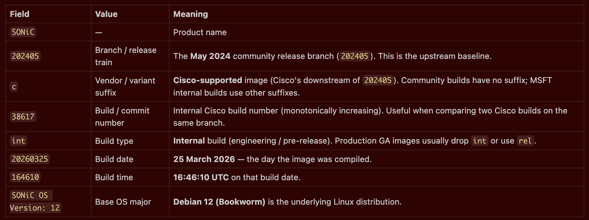
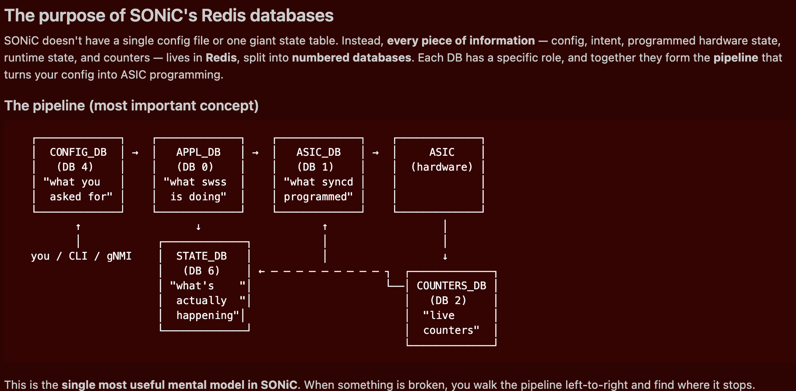

# LABMSI-1011 - Try SONiC { Introductory } - Open Network Operating System powering the Next-gen AI-Data Center

**Objective:** Get comfortable navigating a SONiC device — versions, interfaces, configuration files, the Redis database, and saving config.

**Duration:** 45–60 minutes

**Prerequisites:**
- A running SONiC device (lab leaf, e.g. `leaf00`) reachable over SSH
- Admin credentials (`admin` user)
- Basic Linux / CLI familiarity

---

## Table of Contents

- [Lab Overview](#lab-overview)
- [Lab Topology](#lab-topology)
- [Lab Setup Verification](#lab-setup-verification)
- [Exercise 1: Device & Platform Identity (7 min)](#exercise-1-device--platform-identity-7-min)
- [Exercise 2: Interfaces and Counters (8 min)](#exercise-2-interfaces-and-counters-8-min)
- [Exercise 3: Running Configuration (8 min)](#exercise-3-running-configuration-8-min)
- [Exercise 4: Startup Configuration via `jq` (7 min)](#exercise-4-startup-configuration-via-jq-7-min)
- [Exercise 5: SONiC Architecture via Redis (10 min)](#exercise-5-sonic-architecture-via-redis-10-min)
- [Exercise 6: Saving Configuration (5 min)](#exercise-6-saving-configuration-5-min)
- [Lab Wrap-Up & Cheat Sheet](#lab-wrap-up)

---

## Lab Overview

SONiC is Linux underneath, with a CLI layer (`show`, `config`), an FRR routing stack (`vtysh`), and a Redis-based state database that ties it all together. In this lab you will:

- SSH into a SONiC device and identify the image and platform
- Inspect interfaces, counters, and IP information
- Read the running and startup configurations
- Explore the SONiC architecture through Redis
- Save configuration changes the right way

> **Note:** The lab device is a **containerlab** node running real SONiC on a virtual **Cisco-8101-32FH-O**. All CLI commands, Redis, and config files behave exactly as they do on physical hardware.

---

## Lab Topology


> **Note:** Some nodes may be unavailable due to virtual-host resource limits. You only need access to **one** of the four devices (leaf00/01 or spine00/01) for this lab.

---

## Lab Setup Verification

### Step 1: SSH to the Virtual Host

```bash
ssh -o HostKeyAlgorithms=+ssh-rsa -o PubkeyAcceptedAlgorithms=+ssh-rsa cisco@198.18.128.11
# password: cisco123
cd /home/cisco/cisco8000e/sonic-clab/c8101/ansible
```

### Step 2: Confirm Reachability and SSH to a Leaf

```bash
ping -c 3 leaf00
ssh admin@leaf00
# password: password
```

Expected: a SONiC banner and prompt like `admin@leaf00:~$`.

---

## Exercise 1: Device & Platform Identity (7 min)

### Task 1.1: SONiC Version, Platform, and Boot Image

Run the three identity commands back-to-back — they give a complete picture of *what* is running, *where*, and *what would boot next*.

```bash
show version | head -n 12
show platform summary
show platform version
show boot
```

**Expected (summarized):**

- `show version` → `SONiC Software Version: SONiC.202405c.38617-int-20260325.164610`, Debian 12.13, kernel 6.1, ASIC `cisco-8000`, HwSKU `Cisco-8101-32FH-O`.
- `show platform summary` → confirms `Cisco-8101-32FH-O`, single `cisco-8000` ASIC, `Switch Type: switch` → **fixed (non-modular)** platform.
- `show platform version` → Cisco **Q200 Silicon One** ASIC; **SDK 24.11 train**; separate BSP and FPD versions (used by TAC for hardware diagnostics).
- `show boot` → `Current` = running image (matches `show version`); `Next` = image after reload (differs only if an upgrade is pending); `Available` lists all installed images. SONiC supports **A/B dual-image boot** — only one image is installed here, so there is no rollback target yet.

> **Decoding the version string** — see image below.
> 

---

## Exercise 2: Interfaces and Counters (8 min)

### Task 2.1: Interface and IP Status

```bash
show interfaces status
show ip interfaces
```

**Expected (summarized — `show interfaces status`):**

- **32 front-panel ports** (`Ethernet0`…`Ethernet248`, aliased `etp0`–`etp31`) → matches the **8101-32FH-O** platform (32 × 400G QSFP-DD).
- **Port-name stride is 8** because each port consumes **8 SerDes lanes** (8 × 50G PAM4 = 400G). The `Lanes` column shows the exact ASIC lanes bound to that port.
- **Alias `etpN`** = the physical faceplate label customers see; always map `etpN ↔ EthernetX`.
- Speed `400G`, MTU `9100` (jumbo default), `Vlan = routed` (pure L3 leaf), `FEC = N/A` (inheriting transceiver default — set explicitly in production), all 32 ports `Admin/Oper = up/up`, type `QSFP-DD`.

**Expected (summarized — `show ip interfaces`):**

- `Ethernet0 = 10.1.1.1/31`, `Ethernet8 = 10.1.1.5/31` → /31 point-to-point uplinks to the two spines.
- `Loopback0 = 10.0.0.2/32` → stable router-id / BGP source / VTEP anchor.
- `eth0 = 172.20.2.100/24` → out-of-band mgmt (separate mgmt VRF).
- `docker0` is the internal Docker bridge for SONiC containers — `Oper down` is **normal** when no container is actively bound.
- `Master` column empty → everything in **default VRF**.
- `BGP Neighbor = N/A` here means the table view hasn't been populated; actual BGP sessions are verified via `vtysh` (Exercise 3).

---

### Task 2.2: Counters, Errors, and Real-Time Monitoring

```bash
# Snapshot
show interfaces counters

# Errors only
show interfaces counters errors

# Real-time view (refresh every 5s) — press Ctrl+C to exit
watch -n 5 'show interfaces counters'
```

**Expected (summarized):** Per-port RX/TX packet, bps, utilization, error, drop, and overrun counters. On a quiet lab fabric most counters are 0 with small RX/TX_OK from BGP keepalives and LLDP. A handful of `RX_DRP` is normal on links carrying control-plane traffic.

> **Note:** Optionally, send `ping` traffic from `host00 → host01` and watch the counters increment in real time.

---

### Task 2.3: Clearing Counters

```bash
sonic-clear counters
show interfaces counters | head
```

**Expected:** `Cleared counters`, then the snapshot shows all-zero RX/TX_OK on the next read.

---

## Exercise 3: Running Configuration (8 min)

In SONiC the **running configuration** is the live state in Redis (`CONFIG_DB`, DB #4) plus FRR's live state in `vtysh`. The **startup configuration** is the on-disk file `/etc/sonic/config_db.json` reloaded after reboot.

### Task 3.1: SONiC Running Config

```bash
# Full SONiC running config (JSON), paged
show runningconfiguration all | less

# Section views
show runningconfiguration bgp
show runningconfiguration interfaces

# Single field
show runningconfiguration all | grep docker_routing_config_mode
```

**Expected (last command):**

```
"docker_routing_config_mode": "split",
```

**Observation**

- Config lives in **two places**: platform/system config in CONFIG_DB, and routing config in FRR. `docker_routing_config_mode: split` tells SONiC that routing is **owned by FRR**, not generated from CONFIG_DB.

---

### Task 3.2: FRR Routing Config and BGP State

```bash
vtysh -c "show running-config"
vtysh -c "show ip bgp summary"
vtysh -c "show ip bgp"
```

**Expected (summarized):**

- `show running-config` → FRR-style config (familiar Cisco-like syntax): `router bgp 65002`, neighbors `10.1.1.2` and `10.1.1.6` in AS `65000`, redistribution / network statements.
- `show ip bgp summary` → 2 IPv4 neighbors, `State/PfxRcd = 2` each, sessions `Up` for hours.
- `show ip bgp` → loopback prefixes (`10.0.0.0/32`, `10.0.0.1/32`, `10.0.0.2/32`, local `10.0.0.3/32`) with `*>` best-path markers and ECMP `*=` entries.

> **Note:** These are the **running** FRR values (in memory). They are **not** persisted to disk until you run `write memory` (Exercise 6.4).

---

## Exercise 4: Startup Configuration via `jq` (7 min)

`jq` is the standard JSON processor for Unix — pre-installed on SONiC because its entire config model is JSON. The startup config lives at `/etc/sonic/config_db.json`.

### Task 4.1: Top-Level Tables and Device Metadata

```bash
# Every top-level table in CONFIG_DB
jq 'keys' /etc/sonic/config_db.json

# Device-wide identity & global behavior
jq '.DEVICE_METADATA' /etc/sonic/config_db.json
```

**Expected (`keys`, summarized):** `DEVICE_METADATA`, `PORT`, `INTERFACE`, `LOOPBACK_INTERFACE`, `MGMT_INTERFACE`, `MGMT_PORT`, `FEATURE`, `CRM`, `AUTO_TECHSUPPORT`, `NTP`, `BGP_DEVICE_GLOBAL`, `FLEX_COUNTER_TABLE`, `LOGGER`, `SYSLOG_CONFIG`, `VERSIONS`, etc. Every key maps 1:1 to a Redis hash in CONFIG_DB (DB #4) and has a YANG model in `/usr/local/yang-models/`.

**Expected (`DEVICE_METADATA.localhost`, key fields):**

| Field | Value | Why it matters |
|---|---|---|
| `hostname` | `leaf00` | Device name → prompt, logs, BGP router-id derivation |
| `bgp_asn` | `65001` | Global BGP ASN; FRR builds `router bgp 65001` from this |
| `hwsku` | `Cisco-8101-32FH-O` | Drives `port_config.ini` / `sai.profile` — **must match the HW** |
| `platform` | `x86_64-8101_32fh_o-r0` | Chassis family at the OS level |
| `mac` | `02:42:ac:14:06:64` | Base MAC → iface MACs, router-id fallback, LLDP chassis-id. `02:42:ac:*` = Docker-assigned (clab) |
| `docker_routing_config_mode` | `split` | **Routing owned by FRR**, not CONFIG_DB |
| `default_bgp_status` | `up` | New neighbors come up enabled by default |
| `default_pfcwd_status` | `enable` | PFC Watchdog on — best practice for lossless/AI fabrics |
| `buffer_model` | `traditional` | Static buffer profiles (vs `dynamic`) |
| `type` | `not-provisioned` | ZTP role — production shows `LeafRouter`, `SpineRouter`, etc. |

---

### Task 4.2: Inspect a Port and Its L3 Configuration

```bash
jq '.PORT.Ethernet0' /etc/sonic/config_db.json
jq '.INTERFACE, .LOOPBACK_INTERFACE' /etc/sonic/config_db.json
```

**Expected (summarized):**

- `PORT.Ethernet0` → L1/PHY only: `admin_status=up`, `alias=etp0`, `index=0`, `lanes=2304…2311`, `mtu=9100`, `speed=400000` (kbps = 400G).
- `INTERFACE` and `LOOPBACK_INTERFACE` use the **two-key pattern**:

| Key form | Meaning |
|---|---|
| `"Ethernet0": {}` | Parent — declares the port is L3 (routed). |
| `"Ethernet0\|10.1.1.1/31": {}` | Child — binds one IP to that interface (the `\|` is a key separator). |

So `Ethernet0` carries `10.1.1.1/31` + `2001:db8:1:1::1/127`, `Ethernet8` carries `10.1.1.5/31` + `2001:db8:1:1::5/127`, and `Loopback0` carries `10.0.0.2/32` + `fc00:0:1002::1/128`. IPs are intentionally **not** in the `PORT` table — they belong to the L3 model in `INTERFACE`.

---

## Exercise 5: SONiC Architecture via Redis (10 min)



SONiC uses Redis as the **system-wide message bus and state store** — every container (orchagent, syncd, swss, pmon, FRR helpers, telemetry…) reads and writes Redis instead of talking to each other directly. This gives you a single scriptable place to inspect *everything* the device knows.

| DB # | Name | Purpose |
|------|------|---------|
| 0 | `APPL_DB` | App-layer state (orchagent input) |
| 1 | `ASIC_DB` | What `syncd` programmed into the ASIC (SAI objects) |
| 2 | `COUNTERS_DB` | Live counters polled from the ASIC |
| 4 | `CONFIG_DB` | Running configuration (intent) |
| 6 | `STATE_DB` | Operational state of components (observed reality) |

### Task 5.1: List Keys Across the Five Databases

Run all five — same pattern, different DB. Notice how the key namespaces differ.

```bash
redis-cli -n 4 KEYS '*' | head -10   # CONFIG_DB  — intent
redis-cli -n 0 KEYS '*' | head -10   # APPL_DB    — app pipeline
redis-cli -n 1 KEYS '*' | head -10   # ASIC_DB    — SAI objects in HW
redis-cli -n 6 KEYS '*' | head -10   # STATE_DB   — observed state
redis-cli -n 2 KEYS 'COUNTERS:*' | head -10   # COUNTERS_DB — stats
```

**Expected (summarized):**

| DB | Sample key pattern | What it tells you |
|---|---|---|
| CONFIG_DB (4) | `PORT\|Ethernet0`, `INTERFACE\|Ethernet0\|10.1.1.1/31`, `NTP\|global` | Your **intent** (matches `config_db.json`). Tables joined with `\|`. |
| APPL_DB (0) | `PORT_TABLE:Ethernet0`, `ROUTE_TABLE:10.0.0.2`, `INTF_TABLE:Loopback0:10.0.0.2/32`, `NEIGH_TABLE:Ethernet8:10.1.1.4` | What apps decided to push toward the chip. Tables joined with `:`. |
| ASIC_DB (1) | `ASIC_STATE:SAI_OBJECT_TYPE_PORT:oid:0x100000000000a`, `…SAI_OBJECT_TYPE_QUEUE:…`, `…SAI_OBJECT_TYPE_POLICER:…` | Real SAI objects programmed in HW — what the chip actually accepted. |
| STATE_DB (6) | `PORT_TABLE\|Ethernet0`, `TRANSCEIVER_DOM_THRESHOLD\|Ethernet0`, `TEMPERATURE_INFO\|…`, `PROCESS_STATS\|…` | Live vital signs: link, optics DOM, temps, process health. |
| COUNTERS_DB (2) | `COUNTERS:oid:0x1000000000002`, plus name-maps like `COUNTERS_PORT_NAME_MAP` | Raw per-object counters indexed by OID (need a name→OID lookup). |

> **Tip:** `redis-dump -d 4 -y \| jq` gives you a JSON dump of the entire CONFIG_DB.

---

### Task 5.2: Walk One Port Across All Four Layers

The same physical port (`Ethernet0`) exists in CONFIG_DB (intent), APPL_DB (pipeline), STATE_DB (observed), and COUNTERS_DB (stats). Walking it shows the SONiC data-flow in one shot.

```bash
# 1. Intent  — what you configured
redis-cli -n 4 HGETALL "PORT|Ethernet0"

# 2. Pipeline — what orchagent/portsyncd is pushing
redis-cli -n 0 HGETALL "PORT_TABLE:Ethernet0"

# 3. Observed — current kernel/PHY view
redis-cli -n 6 HGETALL "PORT_TABLE|Ethernet0"

# 4. Stats   — name-to-OID lookup, then read the counters hash
OID=$(redis-cli -n 2 HGET COUNTERS_PORT_NAME_MAP Ethernet0)
echo "Ethernet0 → $OID"
redis-cli -n 2 HGETALL "COUNTERS:$OID" | head -20
```

**Expected (summarized):**

- **CONFIG_DB** → `admin_status=up`, `alias=etp0`, `lanes=2304…2311`, `mtu=9100`, `speed=400000`. Pure L1 intent.
- **APPL_DB** → all CONFIG_DB fields **plus** runtime ones added by orchagent/portsyncd: `oper_status`, `flap_count`, `last_up_time`, `description`. Proof that intent flowed downstream.
- **STATE_DB** → observed reality: `state=ok`, `netdev_oper_status=up`, `host_tx_ready=true`, `fec=rs`, plus capabilities (`supported_speeds`, `supported_fecs`).
- **COUNTERS_DB** → OID like `oid:0x1000000000002`, then a large hash of `SAI_PORT_STAT_*` counters (packets, octets, RMON histogram, FEC symbol bins, PFC, drops). This is what every `show … counters` and telemetry tool reads.

**Observation**

- The same port appears in four DBs with different schemas. CONFIG_DB is **intent**, APPL_DB is **pipeline**, STATE_DB is **observed reality**, COUNTERS_DB is **statistics**. Diffing CONFIG_DB vs APPL_DB vs ASIC_DB is the fastest way to find where a config got dropped on the floor.

---

## Exercise 6: Saving Configuration (5 min)

By default, SONiC does **not** persist runtime changes — a reboot reloads `config_db.json`. You must save explicitly.

### Task 6.1: Change the Hostname (Runtime Only)

```bash
sudo config hostname test-leaf00
exit
ssh admin@leaf00          # banner now reads test-leaf00
```

**Expected:** New SSH banner shows `Linux test-leaf00 …` and prompt `admin@test-leaf00:~$`.

#### Confirm: runtime is changed, but disk is NOT

```bash
# Runtime (Redis CONFIG_DB)
redis-cli -n 4 HGET 'DEVICE_METADATA|localhost' hostname

# Disk (startup file)
jq '.DEVICE_METADATA.localhost.hostname' /etc/sonic/config_db.json
```

**Expected:**

- Redis → `"test-leaf00"` (new)
- Disk → `"leaf00"` (still old)

**Observation:** A reboot **now** would lose the rename — runtime and startup are out of sync.

---

### Task 6.2: Save and Verify

```bash
sudo config save -y
ls -l /etc/sonic/config_db.json
jq '.DEVICE_METADATA.localhost.hostname' /etc/sonic/config_db.json
```

**Expected:**

- `sudo config save -y` → `Running command: /usr/local/bin/sonic-cfggen -d --print-data > /etc/sonic/config_db.json`
- File `mtime` is current.
- `jq` now returns `"test-leaf00"` → runtime and startup are in sync.

---

### Task 6.3: Save FRR Routing Config Separately

FRR has its own persistence — `config save` does **not** touch it.

```bash
vtysh -c "write memory"
```

**Expected:**

```
Note: this version of vtysh never writes vtysh.conf
Building Configuration...
Configuration saved to /etc/frr/zebra.conf
Configuration saved to /etc/frr/bgpd.conf
Configuration saved to /etc/frr/staticd.conf
Configuration saved to /etc/frr/bfdd.conf
```

> [!WARNING]
> `sudo config save -y` saves **SONiC tables** (`/etc/sonic/config_db.json`).
> `vtysh -c "write memory"` saves **FRR routing** (`/etc/frr/*.conf`).
> After any routing change, do **both**.

---

## Lab Wrap-Up

You should now be able to:

- [ ] Identify SONiC version, platform, and boot image
- [ ] Read interface status, IPs, counters, and clear them
- [ ] Inspect both SONiC and FRR running configurations
- [ ] Parse `config_db.json` with `jq`
- [ ] Navigate the five Redis databases that drive SONiC
- [ ] Save SONiC and FRR configuration the right way

### Cheat Sheet

```bash
# --- Identity ---
show version                                       # SONiC + platform + uptime
show platform summary                              # HwSKU / ASIC
show platform version                              # SDK / BSP / FPD
show boot                                          # A/B image slots

# --- Interfaces ---
show interfaces status                             # Link state, lanes, speed, FEC
show ip interfaces                                 # L3 view, VRF, BGP nbr
show interfaces counters                           # Port stats
show interfaces counters errors                    # Errors / drops only
sonic-clear counters                               # Reset

# --- Running config ---
show runningconfiguration all                      # SONiC (JSON)
vtysh -c "show running-config"                     # FRR
vtysh -c "show ip bgp summary"                     # BGP peers

# --- Startup config (jq) ---
jq 'keys' /etc/sonic/config_db.json                # Top-level tables
jq '.DEVICE_METADATA' /etc/sonic/config_db.json    # Identity & globals
jq '.PORT.Ethernet0'  /etc/sonic/config_db.json    # One port
jq '.INTERFACE'       /etc/sonic/config_db.json    # L3 bindings

# --- Redis ---
redis-cli -n 4 KEYS '*' | head                     # CONFIG_DB  (intent)
redis-cli -n 0 KEYS '*' | head                     # APPL_DB    (pipeline)
redis-cli -n 1 KEYS '*' | head                     # ASIC_DB    (SAI in HW)
redis-cli -n 6 KEYS '*' | head                     # STATE_DB   (observed)
redis-cli -n 2 KEYS 'COUNTERS:*' | head            # COUNTERS_DB
redis-cli -n 4 HGET 'DEVICE_METADATA|localhost' hostname

# --- Save ---
sudo config save -y                                # SONiC → /etc/sonic/config_db.json
vtysh -c "write memory"                            # FRR   → /etc/frr/*.conf
```

---

**End of Lab**
